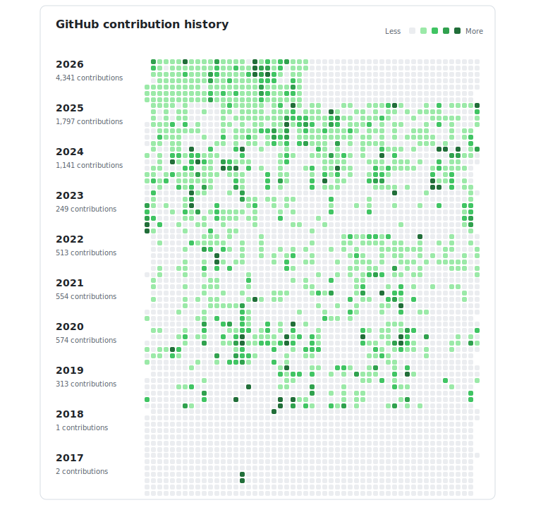

# Sebastian Boehler

Engineer shipping agent tooling, trading infrastructure, on-chain systems, and research software. Based in Germany. Building through [Sunderlabs](https://sunderlabs.com) and shipping projects at [sebastian-boehler.com](https://sebastian-boehler.com).

Public GitHub snapshot as of Mar 12, 2026: 74 public repos, 21 followers, active on GitHub since Apr 19, 2017.

## Contribution history

<picture>
  <source media="(prefers-color-scheme: dark)" srcset="./assets/github-contributions-all-years-dark.svg">
  <source media="(prefers-color-scheme: light)" srcset="./assets/github-contributions-all-years-light.svg">
  
</picture>

All years from 2017-2026 are shown in one stacked calendar so the full activity arc is visible at a glance.

## Current focus

- **Agent tooling:** building fast Go CLIs for AI-assisted development workflows, including dependency diagnostics and deterministic file editing.
- **Autonomous research systems:** shipping production-minded software for closed-loop materials and peptide experimentation.
- **DeFi execution infrastructure:** evolving treasury automation and approval flows for stablecoin operations and Solana liquidity strategies.
- **Academic and civic products:** building university tooling and map-first data products across Alma, ILIAS, mobility, and air-quality workflows.

## Recent public work

- **[agent-cli-utils](https://github.com/SebastianBoehler/agent-cli-utils)** (Go, updated Mar 12, 2026) - Fast Go CLIs for AI agent workflows, including dependency diagnostics and deterministic file-editing utilities.
- **[physics_researcher](https://github.com/SebastianBoehler/physics_researcher)** (Python, updated Mar 11, 2026) - Production-minded software for autonomous materials and peptide research with typed orchestration, simulator adapters, and experiment tracking.
- **[yieldpilot](https://github.com/SebastianBoehler/yieldpilot)** (TypeScript, updated Mar 11, 2026) - ACP-backed treasury operations layer for stablecoin management, wallet automation, and approval flows.
- **[tue-api-wrapper](https://github.com/SebastianBoehler/tue-api-wrapper)** (Python, updated Mar 10, 2026) - Python tooling that layers cleaner navigation, search, and summarization on top of Alma and ILIAS.
- **[stuttgart-pulse](https://github.com/SebastianBoehler/stuttgart-pulse)** (TypeScript, updated Mar 9, 2026) - Map-first open-source explorer for Stuttgart mobility and air-quality data.
- **[tue-cli](https://github.com/SebastianBoehler/tue-cli)** (TypeScript, updated Mar 8, 2026) - Interactive terminal tooling for Tübingen university workflows with menu-driven navigation and colorized output.

## Latest public commits

- **[agent-cli-utils](https://github.com/SebastianBoehler/agent-cli-utils)** `2189ac3` on `main` (Mar 12, 2026) - [Add dependency doctor CLI](https://github.com/SebastianBoehler/agent-cli-utils/commit/2189ac358bf1b8859494bb8fbc4cdf462f8e4066)
- **[agent-cli-utils](https://github.com/SebastianBoehler/agent-cli-utils)** `f5d41cb` on `main` (Mar 12, 2026) - [Add Codex skills for each CLI](https://github.com/SebastianBoehler/agent-cli-utils/commit/f5d41cb0b7fd43536f79a428805ff3ddb0ff9ad0)
- **[agent-cli-utils](https://github.com/SebastianBoehler/agent-cli-utils)** `e2604fb` on `main` (Mar 12, 2026) - [Add deterministic file edit CLI](https://github.com/SebastianBoehler/agent-cli-utils/commit/e2604fb33b117658c8f6ee1727071c11a8ec5c06)
- **[agent-cli-utils](https://github.com/SebastianBoehler/agent-cli-utils)** `05e834a` on `main` (Mar 12, 2026) - [Turn repo into agent CLI toolkit](https://github.com/SebastianBoehler/agent-cli-utils/commit/05e834a713de41256955b2188a613d5b7c52225e)
- **[agent-cli-utils](https://github.com/SebastianBoehler/agent-cli-utils)** `44a9ed4` on `main` (Mar 12, 2026) - [Update README to reflect binary name: agent-cli-utils](https://github.com/SebastianBoehler/agent-cli-utils/commit/44a9ed4560d56b6f953114550903a2920e1899cf)
- **[physics_researcher](https://github.com/SebastianBoehler/physics_researcher)** `4cdfc4b` on `main` (Mar 11, 2026) - [Add purpose rankings to peptide research](https://github.com/SebastianBoehler/physics_researcher/commit/4cdfc4b08a03c0790b18aab9ba6c03fa7589dfdb)

## Links

- [Portfolio](https://sebastian-boehler.com)
- [GitHub](https://github.com/SebastianBoehler)
- [LinkedIn](https://www.linkedin.com/in/sebastian-boehler/)
- [X](https://x.com/sebastianboehle)
