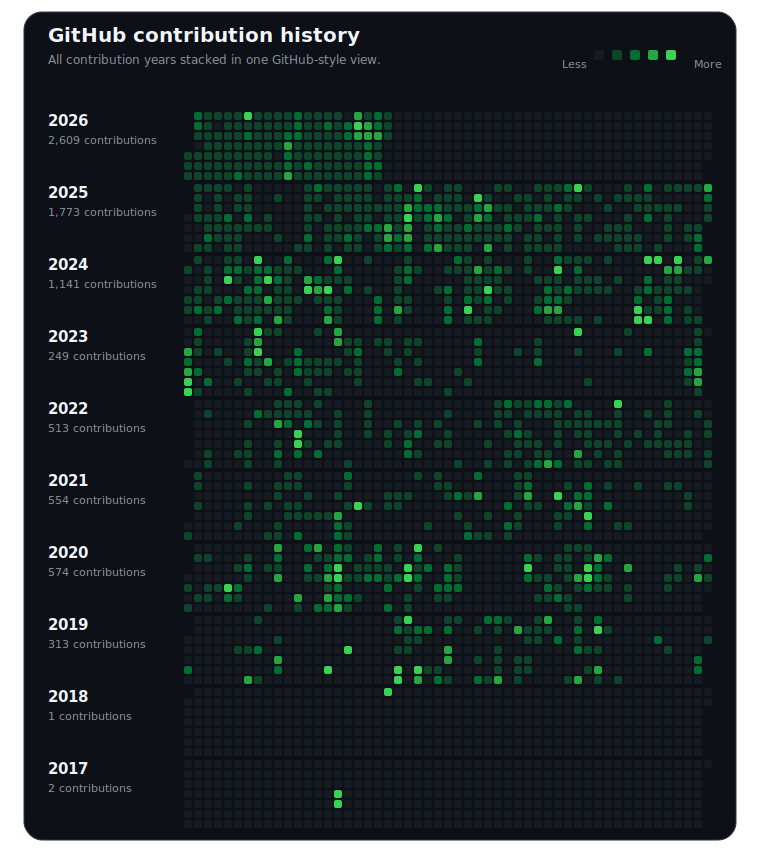

# Sebastian Boehler

Full-stack engineer focused on C++ trading infrastructure, DeFi systems, AI tooling, and product builds. Based in Germany. Building through [Sunderlabs](https://sunderlabs.com) and shipping projects at [sebastian-boehler.com](https://sebastian-boehler.com).

Public GitHub snapshot as of Mar 8, 2026: 70 public repos, 21 followers, active on GitHub since Apr 19, 2017.

## Contribution history

All years from 2017-2026 are shown in one stacked calendar so the full activity arc is visible at a glance.

## Recent public work

- **[stuttgart-pulse](https://github.com/SebastianBoehler/stuttgart-pulse)** (TypeScript, updated Mar 8, 2026) - Stuttgart Pulse is a map-first open-source explorer for Stuttgart mobility and air-quality data.
- **[polymarket-cpp-client](https://github.com/SebastianBoehler/polymarket-cpp-client)** (C++, updated Mar 8, 2026) - Lightweight C++ client for Polymarket APIs with REST and WebSocket support, designed for trading and market data access.
- **[tue-cli](https://github.com/SebastianBoehler/tue-cli)** (TypeScript, updated Mar 3, 2026) - Interactive CLI for WSI/CG remote workflows with a single entry point
- **[poly-arb](https://github.com/SebastianBoehler/poly-arb)** (TypeScript, updated Jan 31, 2026) - High-performance Polymarket arbitrage bot written in C++ for low-latency trading.
- **[bybit-cpp-client](https://github.com/SebastianBoehler/bybit-cpp-client)** (C++, updated Jan 3, 2026) - Lightweight C++ client for Bybit REST v5 with shared signing/HTTP helpers, public/private client split, and examples for linear and spot trading.
- **[bybit_market_maker_cpp](https://github.com/SebastianBoehler/bybit_market_maker_cpp)** (C++, updated Jan 6, 2026) - C++ market-making example for Bybit linear perpetuals: laddered quotes with inventory skew, TP/optional SL, exposure guard, and fee/funding-aware PnL via private websockets.

## Also worth a look

- **[imagegen-canvas](https://github.com/SebastianBoehler/imagegen-canvas)** (1 star) - Canvas based interface for using and orchestrating text-to-image, image-text-to-image and image-to-video
- **[orpheus-podcast](https://github.com/SebastianBoehler/orpheus-podcast)** (4 stars) - Framework for podcast creation with search grounded llms for script generation and open source tts libraries
- **[domain-check-mcp](https://github.com/SebastianBoehler/domain-check-mcp)** (2 stars) - A Model Context Protocol (MCP) server for checking domain availability using IONOS endpoints
- **[solana-dapp-learning](https://github.com/SebastianBoehler/solana-dapp-learning)** (5 stars) - Creating my first DAPP on solana with Next.JS

## Links

- [Portfolio](https://sebastian-boehler.com)
- [GitHub](https://github.com/SebastianBoehler)
- [LinkedIn](https://www.linkedin.com/in/sebastian-boehler/)
- [X](https://x.com/sebastianboehle)
