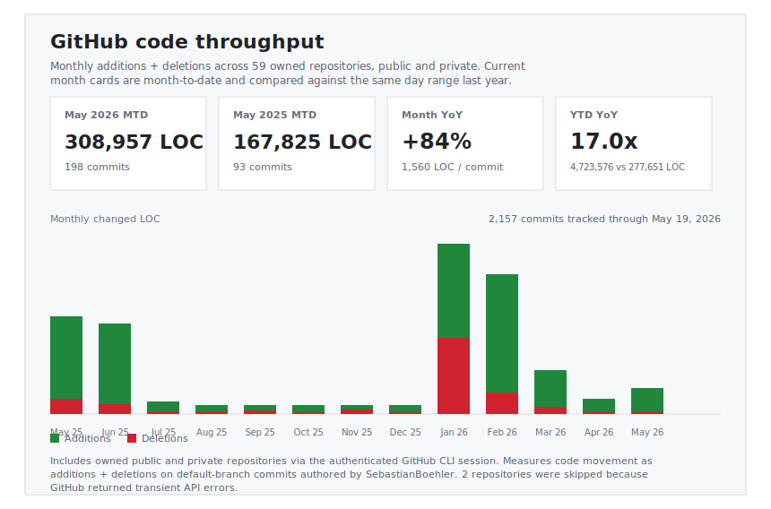

# Sebastian Boehler

Engineer shipping agent tooling, trading infrastructure, on-chain systems, and research software. Based in Germany. Building through [Sunderlabs](https://sunderlabs.com) and shipping projects at [sebastian-boehler.com](https://sebastian-boehler.com).

Public GitHub snapshot as of Apr 11, 2026: 87 public repos, 24 followers, active on GitHub since Apr 19, 2017.

## Contribution history

<picture>
  <source media="(prefers-color-scheme: dark)" srcset="./assets/github-contributions-all-years-dark.svg">
  <source media="(prefers-color-scheme: light)" srcset="./assets/github-contributions-all-years-light.svg">
  
</picture>

All years from 2017-2026 are shown in one stacked calendar so the full activity arc is visible at a glance.

## Code throughput

<picture>
  <source media="(prefers-color-scheme: dark)" srcset="./assets/github-code-throughput-recent-dark.svg">
  <source media="(prefers-color-scheme: light)" srcset="./assets/github-code-throughput-recent-light.svg">
  
</picture>

Monthly additions + deletions offer a second view of output, useful when commits are bundled or AI-assisted workflows change commit cadence.

## Current focus

- **Agent tooling:** building fast Go CLIs for AI-assisted development workflows, including dependency diagnostics and deterministic file editing.
- **Autonomous research systems:** shipping production-minded software for closed-loop materials and peptide experimentation.
- **DeFi execution infrastructure:** evolving treasury automation and approval flows for stablecoin operations and Solana liquidity strategies.
- **Academic and civic products:** building university tooling and map-first data products across Alma, ILIAS, mobility, and air-quality workflows.

## Recent public work

- **[polymarket-cpp-client](https://github.com/SebastianBoehler/polymarket-cpp-client)** (C++, updated Apr 10, 2026) - Lightweight C++ client for Polymarket APIs with REST and WebSocket support, designed for trading and market data access.
- **[tue-api-wrapper](https://github.com/SebastianBoehler/tue-api-wrapper)** (Python, updated Apr 7, 2026) - Python tooling that layers cleaner navigation, search, and summarization on top of Alma and ILIAS.
- **[agent-cli-utils](https://github.com/SebastianBoehler/agent-cli-utils)** (Go, updated Apr 6, 2026) - Fast Go CLIs for AI agent workflows, including dependency diagnostics and deterministic file-editing utilities.
- **[python_livestream](https://github.com/SebastianBoehler/python_livestream)** (HTML, updated Mar 29, 2026) - Livestream AI generated news segments with grok search grounding and TTS frameworks to youtube
- **[compute_atlas](https://github.com/SebastianBoehler/compute_atlas)** (TypeScript, updated Mar 25, 2026) - Open-source compute price oracle for transparent GPU market indexing and Solana devnet publication
- **[MarketTensor](https://github.com/SebastianBoehler/MarketTensor)** (Python, updated Mar 25, 2026) - MarketTensor is a research-first framework for reproducible directional forecasting experiments in crypto perpetuals and futures markets.

## Latest public commits

- **[rower_game_center](https://github.com/SebastianBoehler/rower_game_center)** `37345fe` on `main` (Apr 10, 2026) - [fix(assets): add app icon set](https://github.com/SebastianBoehler/rower_game_center/commit/37345fe7007b629a6238f2b16c5974a62358c46b)
- **[tue-api-wrapper](https://github.com/SebastianBoehler/tue-api-wrapper)** `73ba69f` on `main` (Apr 7, 2026) - [feat(go): add full backend read coverage](https://github.com/SebastianBoehler/tue-api-wrapper/commit/73ba69f955b72f9e0b631b7fe3c0cc5c491e0ac8)
- **[hallmark-mlx](https://github.com/SebastianBoehler/hallmark-mlx)** `5c38707` on `main` (Apr 7, 2026) - [docs(eval): repin hallmark submission packet](https://github.com/SebastianBoehler/hallmark-mlx/commit/5c38707f0e8c07c987831946f9ff2edc8cb5d3e0)
- **[autoresearch_manim_finetune](https://github.com/SebastianBoehler/autoresearch_manim_finetune)** `2c2bb49` on `master` (Apr 7, 2026) - [docs(benchmark): refine pages layout for academic clarity](https://github.com/SebastianBoehler/autoresearch_manim_finetune/commit/2c2bb493fb8a3b3294767e99d039d25220af5862)
- **[autoresearch_manim_finetune](https://github.com/SebastianBoehler/autoresearch_manim_finetune)** `619de67` on `master` (Apr 7, 2026) - [docs(benchmark): publish valid video examples on pages](https://github.com/SebastianBoehler/autoresearch_manim_finetune/commit/619de675ae97f5bbc3518cb26364bfd2e18c982d)
- **[autoresearch_manim_finetune](https://github.com/SebastianBoehler/autoresearch_manim_finetune)** `8176dd1` on `master` (Apr 7, 2026) - [docs(benchmark): add tailwind github pages index](https://github.com/SebastianBoehler/autoresearch_manim_finetune/commit/8176dd186f8b218dfe614808178f31a40e5e89a5)

## Links

- [Portfolio](https://sebastian-boehler.com)
- [GitHub](https://github.com/SebastianBoehler)
- [LinkedIn](https://www.linkedin.com/in/sebastian-boehler/)
- [X](https://x.com/sebastianboehle)
