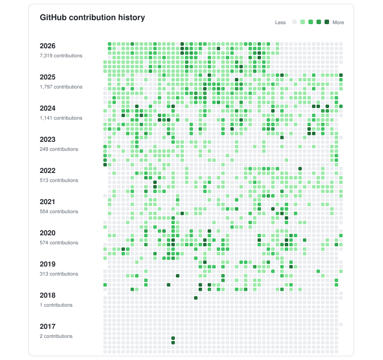

# Sebastian Boehler

Research engineer & founder. I build AI systems and the environments they learn in — simulation, agents, and markets.

M.Sc. Computer Science @ [University of Tübingen](https://uni-tuebingen.de) · based in Germany · [sebastian-boehler.com](https://sebastian-boehler.com) · [Sunderlabs](https://sunderlabs.com)

## Now

- **Learn2Design 2026** — NeurIPS competition track; collaborating toward a paper with physics co-authors after beating the shared baseline *(in progress)*.
- **Agenthon 2026** — multi-track work (coding, forecasting, simulation, explainability) + public [forecast provenance audit](https://github.com/SebastianBoehler/agenthon-forecast-provenance-audit).
- **[Sunderlabs](https://sunderlabs.com) / FlightRL** — compact policies trained in high-throughput sims before hardware.
- **[HB Capital](https://hb-capital.app)** — market structure tooling, backtesting, and RL environments.

## Research

- **[QLoRA Fine-Tuning for Next User Turn Prediction and Multi-Step Dialogue Rollouts](https://doi.org/10.1109/ICETSIS68266.2026.11549360)** — IEEE ICETSIS 2026, pp. 1548–1555. DOI: [10.1109/ICETSIS68266.2026.11549360](https://doi.org/10.1109/ICETSIS68266.2026.11549360).

## Selected public work

| Repo | What it is |
|---|---|
| [polymarket-cpp-client](https://github.com/SebastianBoehler/polymarket-cpp-client) | C++ Polymarket REST + WebSocket client for trading & market data |
| [agent-cli-utils](https://github.com/SebastianBoehler/agent-cli-utils) | Fast Go CLIs for agent workflows (drop-in replacements for slow Python tools) |
| [lecture-pilot](https://github.com/SebastianBoehler/lecture-pilot) | Text-first lecture tutor with a typed workspace & provider-agnostic harness |
| [agenthon-forecast-provenance-audit](https://github.com/SebastianBoehler/agenthon-forecast-provenance-audit) | Source-traced audits of financial labels and grading failures |
| [solana-dapp-learning](https://github.com/SebastianBoehler/solana-dapp-learning) | Solana dapps with Next.js, Anchor, and Pyth |
| [sec-data-fetcher](https://github.com/SebastianBoehler/sec-data-fetcher) | Rust SEC EDGAR / financial-data toolkit |

## Background

Backend at **[LI.FI](https://li.fi/)** (on-chain data connectors) · co-founder **[HB Capital](https://hb-capital.app)** · founder **[Sunderlabs](https://sunderlabs.com)** · previously **[Remotly](https://www.remotly.io/)** and freelance [Boehler IT Solutions](https://www.linkedin.com/company/boehler-it-solutions).

## Contribution history

<picture>
  <source media="(prefers-color-scheme: dark)" srcset="./assets/github-contributions-all-years-dark.svg">
  <source media="(prefers-color-scheme: light)" srcset="./assets/github-contributions-all-years-light.svg">
  
</picture>

## Links

- [Portfolio](https://sebastian-boehler.com)
- [Hugging Face](https://huggingface.co/sebastianboehler)
- [LinkedIn](https://www.linkedin.com/in/sebastian-boehler/)
- [X](https://x.com/sebastianboehle)
